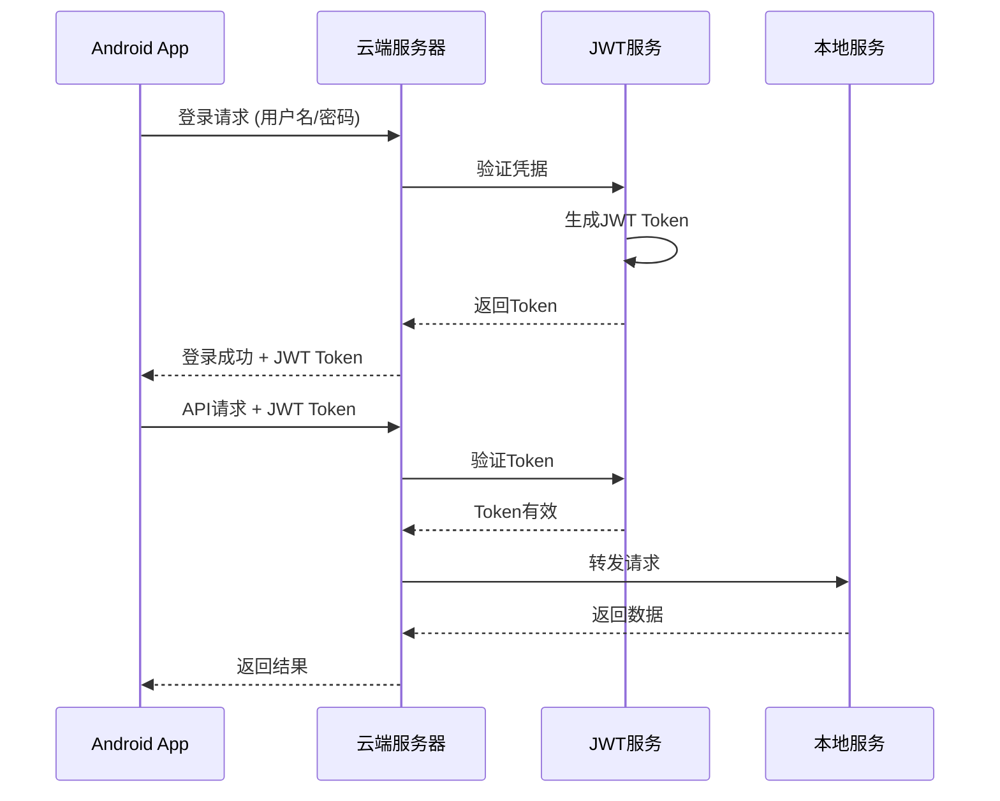

# 旅游助手系统架构文档

## 系统概述

旅游助手采用**本地+云端协同架构**，通过内网穿透实现云端对本地的访问，最大化利用本地算力，降低云端压力。

**架构更新 (2024-01-28)**: 已完成代码重构，采用模块化架构设计，消除了技术债务。

## 架构图

```
┌─────────────────┐
│   Android APP   │ ← JWT认证
│  ┌───────────┐  │
│  │ AuthManager │  │
│  │ Token管理  │  │
│  └─────┬─────┘  │
└──────┬┬─────────┘
       ││ HTTPS
       │↓ (Bearer Token)
┌──────────────────┐
│  云端服务器       │
│  (121.43.58.117) │
│                  │
│  ┌──────────────┐│
│  │ Flask后端    ││
│  │ ┌──────────┐ ││
│  │ │ JWT认证  │ ││
│  │ │ 中间件   │ ││
│  │ └──────────┘ ││
│  │ ┌──────────┐ ││
│  │ │ 输入验证  │ ││
│  │ │ 安全过滤  │ ││
│  │ └──────────┘ ││
│  │ - 调度中心    ││
│  │ - API网关    ││
│  │ - 大模型调用  ││
│  └─────┬───────┘│
└────────┼──────────┘
         │ 内网穿透 (安全)
         ↓
┌──────────────────┐
│  本地电脑        │
│                  │
│  ┌──────────────┐│
│  │ Flask服务    ││
│  │ - 爬虫服务   ││
│  │ - 数据清洗   ││
│  │ - 向量化     ││
│  │ - 向量检索   ││
│  └─────┬───────┘│
│        │          │
│  ┌─────┴───────┐│
│  │ ChromaDB    ││
│  │ 向量数据库   ││
│  └─────────────┘│
└──────────────────┘
```

**🔒 安全架构亮点**:
- JWT Token认证机制 (无状态认证)
- 多层输入验证 (防SQL注入、XSS)
- CORS策略和HTTP安全头
- API速率限制和异常检测
- 密码bcrypt安全哈希
- HTTPS传输加密

## 核心组件

### 1. Android APP

**职责**:
- 提供用户交互界面
- 发送API请求到云端
- 展示结构化数据

**技术栈**:
- Kotlin
- Jetpack Compose
- Retrofit (网络请求 + 自动认证)
- Room (本地数据库)
- SharedPreferences (加密Token存储)
- Flow (响应式状态管理)

**安全特性**:
- 自动Token管理 (过期检测 + 刷新)
- 加密本地存储
- 认证状态实时同步
- 网络请求自动注入认证头

### 2. 云端服务器

**职责**:
- 接收APP请求
- 转发指令到本地
- 调用大模型API
- 结构化处理数据
- 返回结果给APP

**技术栈**:
- Ubuntu 22.04
- Python 3
- Flask + 模块化架构
- Nginx (反向代理 + SSL终止)
- Docker (容器化)

**关键服务**:
- Flask后端服务 (端口5000)
- JWT认证中间件
- 输入验证层
- Nginx反向代理 (端口80/443)
- 内网穿透服务

**安全组件**:
- JWT Token认证服务
- 输入验证和过滤
- CORS策略配置
- HTTP安全头中间件
- API速率限制
- 安全日志记录

### 3. 本地电脑

**职责**:
- 执行爬虫任务
- 数据清洗和预处理
- 文本向量化
- 向量相似度检索
- 数据存储管理

**技术栈**:
- Python 3
- Flask
- ChromaDB
- SentenceTransformer
- Selenium (爬虫)

**关键服务**:
- Flask后端服务 (端口5001)
- ChromaDB服务
- 爬虫服务
- 向量化服务

### 4. 向量数据库 (ChromaDB)

**职责**:
- 存储文本向量
- 执行相似度检索
- 数据持久化

**数据结构**:
```python
{
  "id": "uuid",
  "documents": "文本内容",
  "embeddings": [向量数据],
  "metadatas": {
    "destination": "目的地",
    "images": ["图片URL"],
    "author": "作者"
  }
}
```

### 5. 大模型API (阿里云通义千问)

**职责**:
- 基于用户问题和相关攻略生成回答
- 提供结构化输出

**调用流程**:
1. 云端接收用户问题和检索到的攻略
2. 组装提示词（问题+攻略+提示模板）
3. 调用通义千问API
4. 解析返回结果
5. 结构化处理返回给APP

## 数据流

### 场景一：小红书授权与数据爬取

```
APP → 云端 → 本地 → 小红书
     ↓      ↓      ↓
    存储   指令   爬取
     ↓      ↓      ↓
    结果   通知   数据
     ↓      ↓      ↓
    展示   完成   入库
```

**详细步骤**:
1. 用户在APP完成小红书授权
2. APP将授权信息发送至云端
3. 云端转发授权信息到本地
4. 本地启动爬虫任务
5. 爬取小红书旅游攻略
6. 本地清洗和向量化数据
7. 存入ChromaDB
8. 本地通知云端完成
9. 云端返回状态给APP

### 场景二：旅游攻略搜索

```
APP → 云端 → 本地 → ChromaDB
     ↓      ↓      ↓
    问题   转发   检索
     ↓      ↓      ↓
    等待   结果   攻略
     ↓      ↓      ↓
    大模型  组装   返回
     ↓      ↓      ↓
    结构化  API    完成
     ↓      ↓      ↓
    展示   返回   结束
```

**详细步骤**:
1. 用户在APP输入搜索关键词
2. APP发送搜索请求到云端
3. 云端转发问题到本地
4. 本地向量化问题
5. 检索ChromaDB获取相关攻略
6. 本地返回攻略到云端
7. 云端调用大模型API生成回答
8. 结构化处理大模型回答
9. 返回结果给APP
10. APP展示结构化结果

## 🔐 认证与安全架构

### JWT认证流程



### 认证服务架构

#### 1. JWT认证服务 ✅
- **位置**: `backend/modular_api/services/auth.py`
- **功能**: Token生成、验证、刷新
- **特性**: 无状态认证、支持分布式
- **安全**: bcrypt密码哈希、Token过期机制

#### 2. 认证中间件 ✅
- **装饰器**: `@auth_required`, `@optional_auth`
- **功能**: 自动Token验证、用户身份识别
- **安全**: 统一认证入口、错误处理

#### 3. 输入验证层 ✅
- **位置**: `backend/modular_api/utils/validation.py`
- **功能**: 多层验证、防注入攻击
- **覆盖**: 所有API端点、输入参数

### Android端认证管理

#### 1. AuthManager ✅
- **位置**: `android-app/data/auth/AuthManager.kt`
- **功能**: Token生命周期管理、状态同步
- **特性**: Flow响应式、自动过期检测

#### 2. 网络拦截器 ✅
- **位置**: `android-app/data/api/NetworkModule.kt`
- **功能**: 自动Token注入、过期处理
- **特性**: 透明认证、自动刷新

### 安全防护机制

#### 1. 传输安全 ✅
- **HTTPS**: 强制SSL/TLS加密
- **CORS策略**: 环境差异化配置
- **安全HTTP头**: X-Frame-Options、XSS-Protection等

#### 2. 数据安全 ✅
- **密码安全**: bcrypt哈希存储
- **Token安全**: 本地加密存储
- **输入过滤**: SQL注入、XSS防护

#### 3. 访问控制 ✅
- **API速率限制**: 区分认证/非认证用户
- **权限控制**: 基于角色的访问控制
- **异常检测**: 登录异常行为监控

#### 4. 安全审计 ✅
- **认证日志**: 登录/登出/Token刷新记录
- **访问日志**: 完整API访问记录
- **安全事件**: 异常行为告警

### 网络安全配置

#### 1. CORS安全策略
```python
# 开发环境 - 允许所有
CORS_ORIGINS = "*"

# 生产环境 - 限制域名
CORS_ORIGINS = "https://yourdomain.com,https://app.yourdomain.com"
```

#### 2. HTTP安全头
```python
# 安全响应头配置
{
    "X-Content-Type-Options": "nosniff",
    "X-Frame-Options": "DENY",
    "X-XSS-Protection": "1; mode=block",
    "Referrer-Policy": "strict-origin-when-cross-origin",
    "Content-Security-Policy": "default-src 'self'",
    "Strict-Transport-Security": "max-age=31536000"
}
```

#### 3. API速率限制
```python
# 速率限制配置
未认证用户: 30次/分钟/IP
已认证用户: 120次/分钟/用户
登录端点: 5次/分钟/IP
Token刷新: 10次/分钟/用户
```

---

## 🚨 原有安全机制 (已升级)

### 1. API认证 (已升级为JWT)
- ✅ JWT Token认证替代API密钥
- ✅ 无状态认证，支持分布式部署
- ✅ 自动过期和刷新机制

### 2. 数据加密 (保持)
- ✅ HTTPS加密传输
- ✅ 敏感数据本地加密存储
- 🔄 数据库连接使用SSL (生产环境配置)

### 3. 访问控制 (已增强)
- ✅ 请求频率限制 (差异化)
- ✅ IP白名单 (可选)
- ✅ CORS配置 (环境差异化)
- ✅ 认证状态管理

### 4. 日志审计 (已增强)
- ✅ 记录所有API请求
- ✅ 认证事件详细记录
- ✅ 异常行为检测
- ✅ 安全事件告警

## 性能优化

### 1. 缓存策略
- Redis缓存高频查询
- 本地缓存向量模型
- APP端缓存常用数据

### 2. 并发处理
- 异步处理爬虫任务
- 批量向量化文本
- 并发检索向量数据库

### 3. 数据库优化
- ChromaDB索引优化
- SQLite查询优化
- 定期清理过期数据

## 容灾备份

### 1. 数据备份
- ChromaDB定期备份
- SQLite数据库备份
- 日志文件归档

### 2. 服务高可用
- 云端服务自动重启
- 本地服务监控告警
- 故障自动切换

### 3. 灾难恢复
- 数据恢复流程
- 服务恢复流程
- 应急响应预案

## 监控告警

### 1. 系统监控
- CPU、内存、磁盘监控
- 网络流量监控
- 服务状态监控

### 2. 业务监控
- API调用统计
- 爬虫任务监控
- 向量检索性能

### 3. 告警机制
- 邮件告警
- 短信告警
- 即时通讯告警

## 扩展性设计

### 1. 水平扩展
- 云端服务可多实例部署
- 本地服务可分布式部署
- 向量数据库可分片

### 2. 功能扩展
- 支持多数据源爬取
- 支持多种大模型
- 支持多语言处理

### 3. 接口扩展
- RESTful API设计
- GraphQL支持（可选）
- WebSocket实时通信（可选）
